**Student:** FOKEMG-YALIE Brisco Elias  
**Registration Number:** 2026/FCDF/16853  
**Course:** WADF105: Network Security Fundamentals    
**Submission deadline:** October 06, 2026, 23:59 WAT
**International Cybersecurity and Digital Forensics Academy (ICDFA)**

# Lab 1 — Two-VM Network Commissioning and Connectivity Verification

## Scenario

The laboratory uses two VirtualBox machines: `icdfa-nslab-client-v1`, an Ubuntu workstation, and `icdfa-nslab-firewall-v1`, an OPNsense firewall. The workstation communicates with the firewall on the protected LAN and uses it as the gateway for internet access.

The task was to configure the virtual network adapters, verify WAN and LAN interfaces, check Ubuntu IPv4 addressing and routing, test connectivity and name resolution, access the firewall management interface, and observe ARP, ICMP and DNS packets in Wireshark. All work was carried out in the authorised ICDFA laboratory environment.

## Required network configuration

| Machine | Adapter | Required connection |
|---|---|---|
| OPNsense firewall | Adapter 1 | NAT |
| OPNsense firewall | Adapter 2 | Internal Network: `ICDFA-LAN` |
| Ubuntu client | Adapter 1 | Internal Network: `ICDFA-LAN` |

The brief specifies `10.10.10.1/24` for the firewall LAN and DHCP for the Ubuntu client. Both internal adapters must use exactly `ICDFA-LAN`. The firewall must start before the client.

## Part A — Prepare VirtualBox

The screenshots show the laboratory VMs powered off during preparation and the internal network settings for the firewall and client.

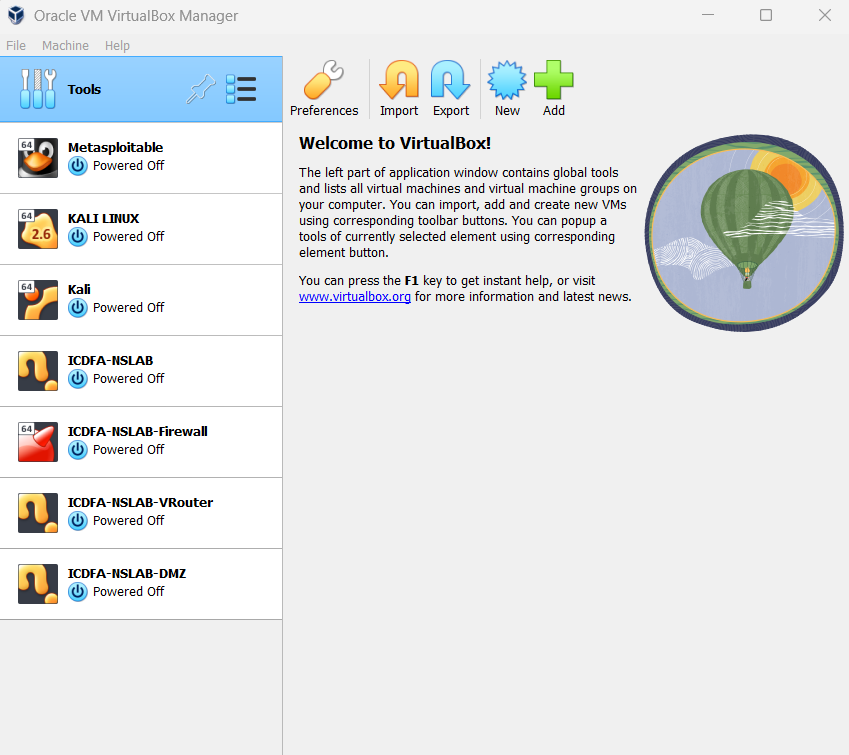

*VirtualBox laboratory machines during preparation.*

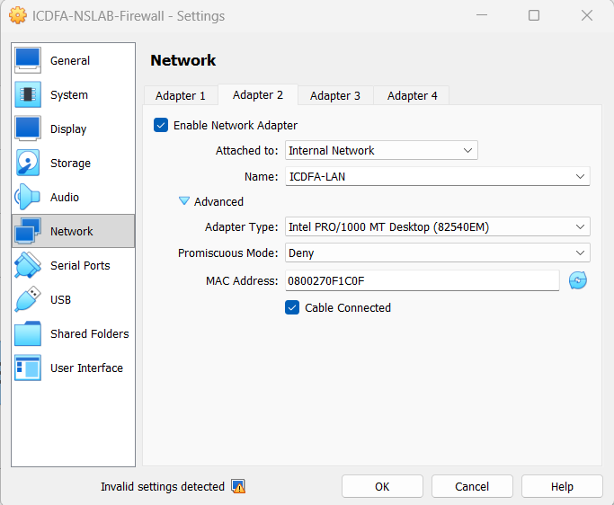

*Firewall Adapter 2 attached to ICDFA-LAN with Cable Connected enabled.*

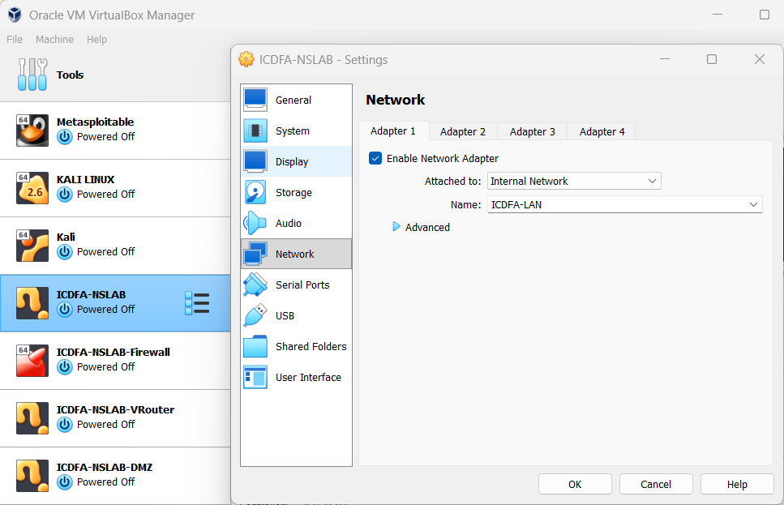

*Ubuntu Adapter 1 attached to ICDFA-LAN with Cable Connected enabled.*


Using the same internal network connects the Ubuntu workstation and the firewall LAN to the same virtual Ethernet segment.

## Part B — Verify OPNsense interfaces

The OPNsense console shows:

| Interface | Device | IPv4 address |
|---|---|---|
| LAN | `em1` | `10.10.10.1/24` |
| WAN | `em0` | `10.0.2.15/24`, obtained through DHCP |

The LAN interface connects to the protected network and acts as the Ubuntu client's gateway. The WAN interface provides the upstream connection.

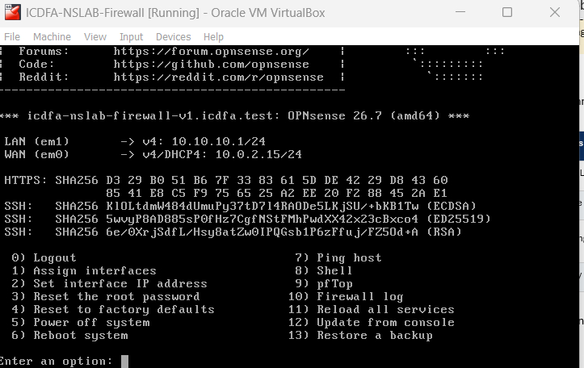

*OPNsense console displaying WAN and LAN interface assignments and addresses.*


## Part C — Verify Ubuntu addressing

### IPv4 address and interface status

I checked the IPv4 configuration with:

```bash
ip -4 -br address
```

The output shows `enp0s3` in the `UP` state with address `10.10.10.2/24`. This places the client in the same `10.10.10.0/24` subnet as the firewall LAN. The `/24` prefix corresponds to subnet mask `255.255.255.0`.

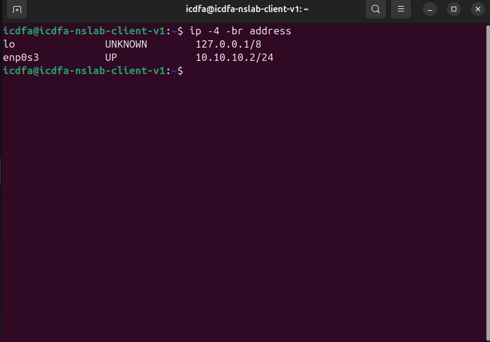

*Ubuntu interface enp0s3 is UP with IPv4 address 10.10.10.2/24.*


### Routing and default gateway

I checked the routing table with:

```bash
ip route
```

The output shows:

```text
default via 10.10.10.1 dev enp0s3 proto static metric 20100
10.10.10.0/24 dev enp0s3 proto kernel scope link src 10.10.10.2 metric 100
```

The default gateway is `10.10.10.1`. Ubuntu uses this gateway for destinations outside its directly connected LAN. The recorded configuration uses a static default route; it does not show a DHCP lease.

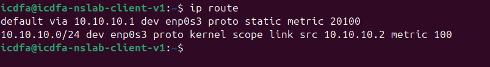

*Ubuntu routing table showing the default route through 10.10.10.1.*


## Part D — Perform connectivity tests

### 1. Reach the firewall LAN

```bash
ping -c 4 10.10.10.1
```

The test sent four packets and received four replies, with **0% packet loss**. This confirms connectivity between Ubuntu and the OPNsense LAN interface.

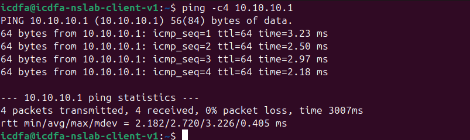

*Successful ping to the firewall gateway: four replies and 0% packet loss.*


### 2. Test internet connectivity by IP address

```bash
ping -c 4 1.1.1.1
```

The test also received four replies with **0% packet loss**. This confirms that the Ubuntu client could reach an external IPv4 destination through the configured network path.

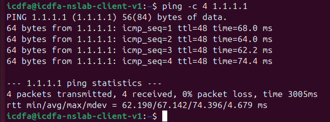

*Successful ping to 1.1.1.1: four replies and 0% packet loss.*


### 3. Test name resolution

```bash
getent hosts opnsense.org
```

The command returned the following addresses:

```text
3.33.130.190    opnsense.org
15.197.148.33   opnsense.org
```

This confirms that the hostname was resolved during the test.

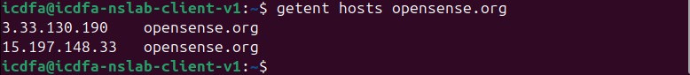

*Name-resolution result for opnsense.org.*


### 4. Test web access

The command shown in my screenshot is:

```bash
curl -I http://opnsense.org
```

It returned `HTTP/1.1 200 OK`. This records an HTTP response. The brief asks for `curl -I https://opnsense.org`; the supplied screenshot shows the HTTP test rather than a successful HTTPS test.

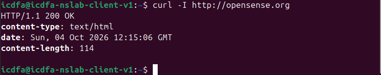

*HTTP response headers received using curl.*


### 5. Access the OPNsense management interface

I accessed the OPNsense dashboard at the firewall LAN address, `10.10.10.1`. The dashboard displays WAN address `10.0.2.15/24` and LAN address `10.10.10.1/24`.

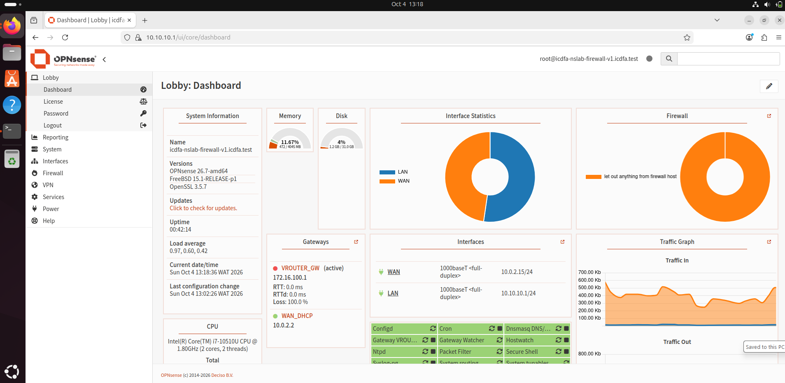

*OPNsense management dashboard showing WAN and LAN status.*


## Part E — Observe packets in Wireshark

I captured traffic on the Ubuntu Ethernet interface `enp0s3` and inspected the exchanges using the requested display filters.

### ARP

Display filter:

```text
arp
```

The capture shows the request:

```text
Who has 10.10.10.1? Tell 10.10.10.2
```

The reply announces:

```text
10.10.10.1 is at 08:00:27:34:2a:f8
```

This exchange allows Ubuntu to learn the firewall LAN MAC address before sending Ethernet frames to the gateway.

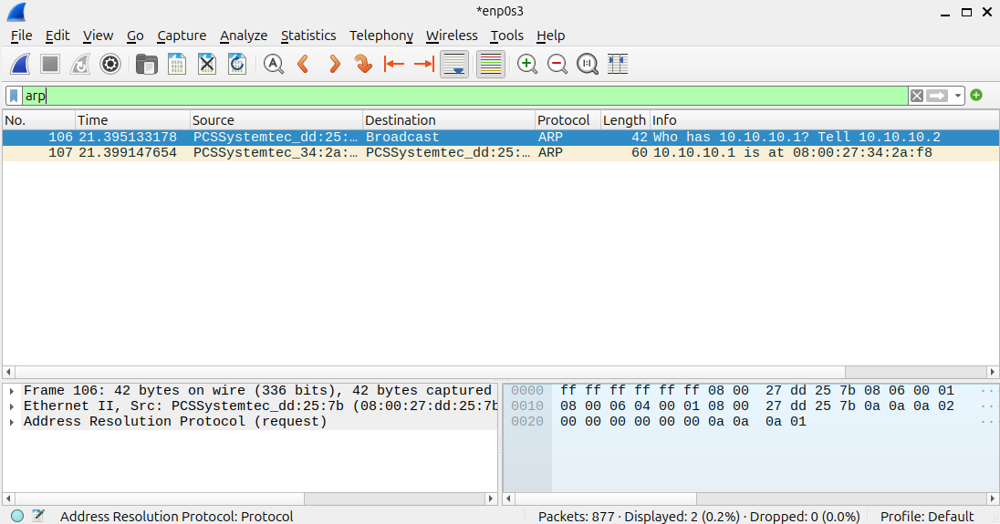

*Wireshark ARP view showing the gateway request and firewall MAC reply.*


### ICMP

Display filter:

```text
icmp
```

The capture shows eight packets between `10.10.10.2` and `10.10.10.1`: four Echo Requests from Ubuntu and four Echo Replies from OPNsense. This matches the successful gateway ping.

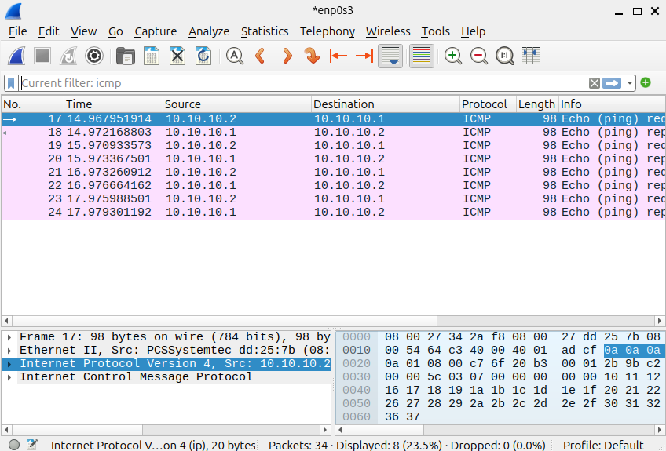

*Wireshark ICMP view showing four Echo Request and Echo Reply pairs.*


### DNS

Display filter:

```text
dns
```

The capture shows queries from `10.10.10.2` to the DNS resolver `1.1.1.1` and responses travelling in the reverse direction. These exchanges were inspected for the `opnsense.org` name-resolution activity. The screenshot displays four DNS packets; the detailed Queries and Answers sections are not expanded.

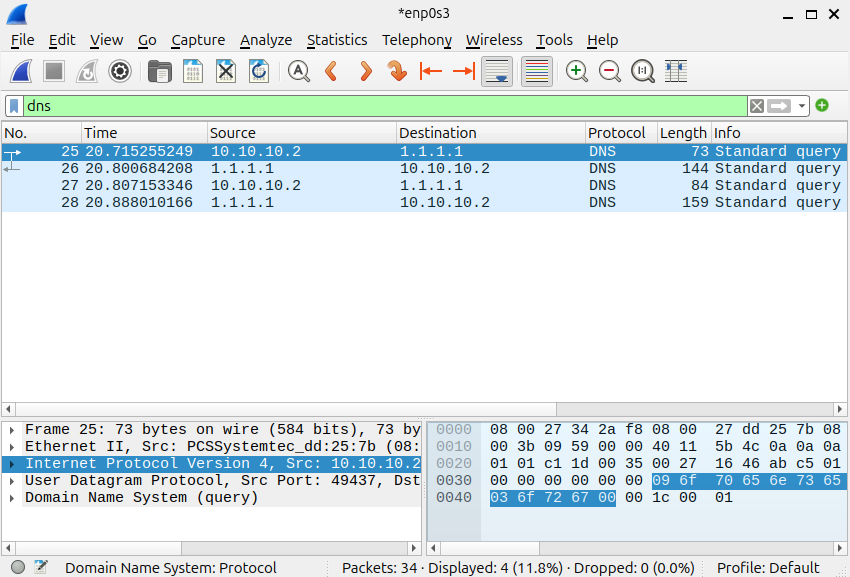

*Wireshark DNS view showing client queries and resolver responses.*


## Completion questions

### 1. What is the difference between the OPNsense WAN and LAN interfaces?

WAN connects the firewall to the upstream network. LAN connects it to the protected local network. In this lab, LAN uses `10.10.10.1/24`, while WAN obtains `10.0.2.15/24` through DHCP.

### 2. Why must both internal adapters use the same VirtualBox network name?

The name identifies the virtual network segment. Both adapters must use `ICDFA-LAN` so that the client and firewall LAN can communicate directly.

### 3. What information does the default route provide to Ubuntu?

It identifies the gateway and outgoing interface used for destinations without a more specific route. In my routing table, these are `10.10.10.1` and `enp0s3`.

### 4. Which packet exchange allows Ubuntu to learn the firewall MAC address?

The ARP Request and ARP Reply exchange. Ubuntu asks who owns `10.10.10.1`, and the firewall replies with its MAC address.

### 5. Why does a successful ping to 1.1.1.1 not automatically prove that DNS is working?

The ping uses a numeric IP address and does not require a hostname lookup. DNS must be tested separately, as done with `getent hosts opnsense.org`.

## Conclusion

This practical work helped me understand how VirtualBox network adapters, IPv4 addressing and a default gateway enable communication between Ubuntu and OPNsense. I verified local gateway reachability, internet connectivity by IP address, name resolution and firewall management access. Wireshark allowed me to observe the ARP exchange that discovers the gateway MAC, the ICMP request/reply pairs used by ping, and DNS queries and responses. These results connect the network configuration to the packets exchanged during normal communication.
